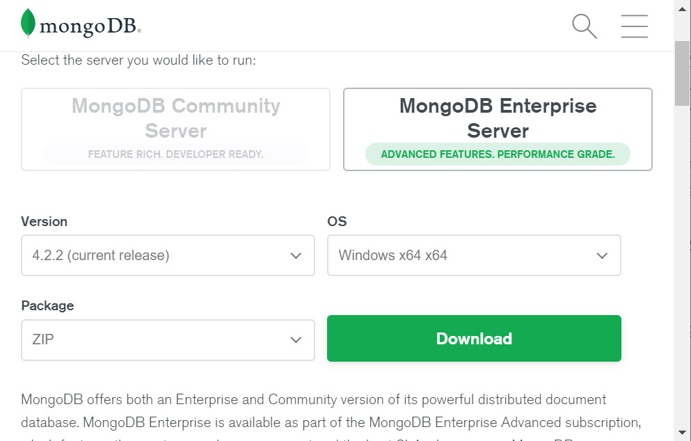
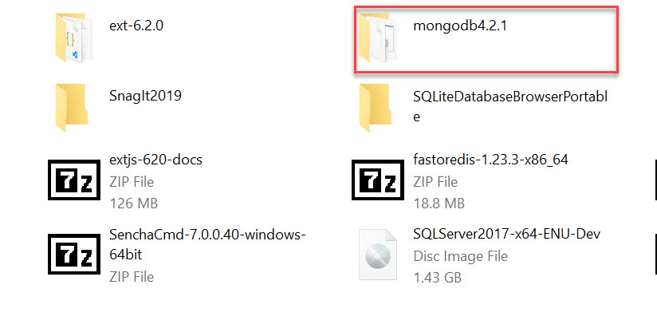
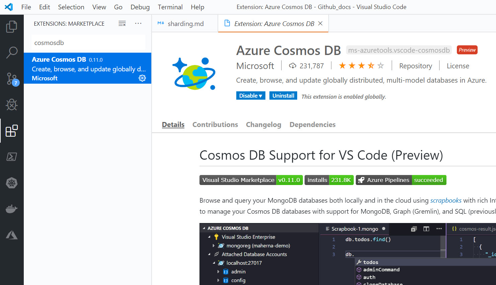
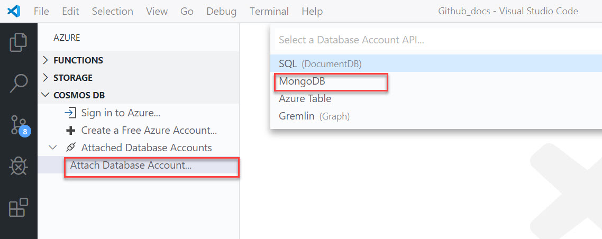
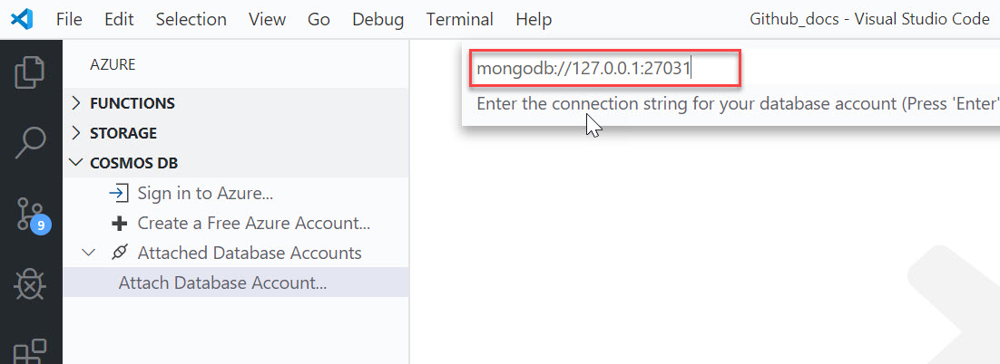
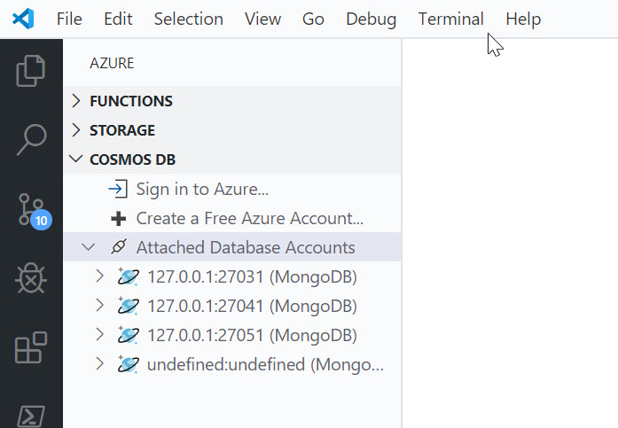
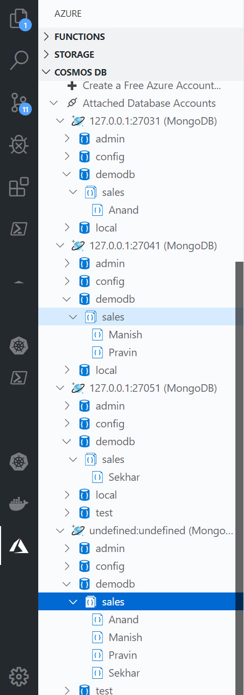

## Sharding in MongoDB
Sharding is the process of storing the documents in multiple MongoDB servers instead of storing in a single MongoDB instance. It helps us to improve the performance of the query process. A single instance of the MongoDB Server will not be sufficient to store the growing data. MongoDB uses sharding to support deployments with very large data sets and high throughput operations. Sharding horizontally scales the mongodb instances. 

### Sharded cluster
A MongoDB sharded cluster consists of the following components:

* **shard**: Each shard contains a subset of the sharded data. Each shard can be deployed as a replica set.
* **mongos (router)**: The mongos acts as a query router, providing an interface between client applications and the sharded cluster.
* **config servers**: Config servers store metadata and configuration settings for the cluster. As of MongoDB 3.4, config servers must be deployed as a replica set (CSRS).

    

### Setting up sharded cluster
Prerequisites
* MongoDB 4.2.x 
* Visual Studio Code with CosmosDB extension

#### Downloading and preparing MongoDB and VS Code
1. Open browser and navigate to [Download](https://www.mongodb.com/download-center/enterprise) page of MongoDB and download the Zip archive of the current version of MongoDB

2. Extract the downloaded archive to another folder.
3. Rename the directory to `mongodb-4.2.x` to reduce the length of the directory name.

4. Open command prompt and create a directory with the name `mongodb` in the preferred location. (Here we use C:\ as location).
    > C:\ md mongodata    
5. Move to the`mongodata` directory and create 4 subdirectories with the names `config`, `data`, `data2` and `data3`.
    > C:\mongodata > cd mongodata
    > C:\mongodata > md config
    > C:\mongodata > md data1
    > C:\mongodata > md data2
    > C:\mongodata > md data3
6. Now, we need to setup the VS Code. Download and install the latest version of *VS Code* from the [download](https://code.visualstudio.com/download) page.
7. After installing VS Code , open and install the `CosmosDB` extension for VS code.

#### Setup Sharded cluster
1. First we can setup a `config server` for out sharded cluster. From version 3.4 onwards *config servers* must be created with replic set. For production scenario it is recommended to use a replica set with minimum 3 instances. For this demo setup we can use a single member replica set. Run the following command to create a *config server* with a replica set.
    > mongod --configsvr --replSet crs --dbpath c:\mongodata\config
2. The *config server* will start in the default port number *27019*. You can now connect to the *config server* and initilize the replica set with default configuration. Connect to the config server using the mongo shell.
    > mongo localhost:27019
3. Run the following command to configure the replica set. 
    > rs.initiate()
4. You can check the status of the replica set by running the folowing code.
    > rs.status()
5. Now, we can set up the shard members. Each shard member must be running in replica set. In production deployments, you can create a 3 node replica set for each shard member. For this demo we will be using a single member replica set for each shard instance. Run the following commands from command prompt to start 3 shard members in respective replicasets. 
    > mongod --shardsvr --replSet srs1  --dbpath c:\mongodata\data1 --port 27031	

    > mongod --shardsvr --replSet srs2 --dbpath c:\mongodata\data2 --port 27041

	> mongod --shardsvr --replSet srs3  --dbpath c:\mongodata\data3 --port 27051
6. Now, you need to configure the replica set for each shard member. Open a command terminal and connect to the first shard member by running the following command.
    > mongo localhost:27031

    > rs.initiate()

    > rs.status()
7. Connect to next shard member and perform the same steps 
    > mongo localhost:27041

    > rs.initiate()

    > rs.status()

8. Also, configure the last shard member.
    > mongo localhost:27051

    > rs.initiate()

    > rs.status()

9. Now, we  need to start the *router* for our sharded cluster. The *router* is accepting the requests from the client applications and route to the appropriate shard member with the help of config server. A production deployment may contain more than one router. In this demo, we will be using a single shard router. Run the following command to start the router.
    > mongos --configdb crs/localhost:27019 --bind_ip localhost --port 27017
10. Connect to the router and add the shard members.
    > mongo localhost:27017

    > sh.addShard("srs1/localhost:27031");

    > sh.addShard("srs2/localhost:27041);

    > sh.addShard("srs3/localhost:27051");

11. Now, enable the sharding for the database. We can try with a sample database with the name `demodb`.
    > sh.enableSharding("demodb");
12. Configure the shard collection with the shard key and scenario. We will be using hash based sharding instead of range based sharding. We will be enabling sharding for `sales` collection with the shard key `region`. 

    > sh.shardCollection("demodb.sales", { region:"hashed"});
13. You can now insert a set of documents to the `sales` collection in `demodb` database. Run the following commands to insert some sample documents. Make sure that every document contains a shard key `region` in the document.
    > use demodb;

    > db.sales.insertOne({ name: 'Anand', amount:12500,  region:'West'});
    > db.sales.insertOne({ name: 'Sekhar', amount:43000,  region:'North'});
    > db.sales.insertOne({ name: 'Pravin', amount:55000,  region:'East'});
    > db.sales.insertOne({ name: 'Manish', amount:55000,  region:'East'});

14. Open VS Code and connect to the mongodb shard instances and router using the CosmosDB extension. In VS Code Cosmosdb extension, add a mongodb shard instance using the attached databse option. 
    
15. Connect to each shard member by specifying the hostname and port number. 
    
16. Add all the shard members and router to the VS Code.
    
17. Expand the sharded nodes and verify the distribution of documents across sharded members.
    
---
References: https://docs.mongodb.com/manual/sharding/

